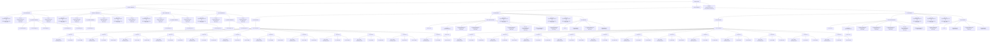

# AttnHeteroGNN モデル構造

自動生成: 2026-09-18 15:10:10（train.py 実行時に上書きされる）

- 総パラメータ数: 283,550
- 学習対象パラメータ数: 283,550

```mermaid
graph TD
    n0["AttnHeteroGNN"]
    n1["encoders: ModuleDict"]
    n0 --> n1
    n2["stock: NodeEncoder"]
    n1 --> n2
    n3["cont_norm: LayerNorm((11,), eps=1e-05, elementwise_affine=True, bias=True)"]
    n2 --> n3
    n4["cont_lin: Linear(in_features=11, out_features=64, bias=True)"]
    n2 --> n4
    n5["cat_embeds: ModuleList"]
    n2 --> n5
    n6["0: Embedding(35, 8)"]
    n5 --> n6
    n7["1: Embedding(19, 8)"]
    n5 --> n7
    n8["2: Embedding(9, 8)"]
    n5 --> n8
    n9["3: Embedding(12, 8)"]
    n5 --> n9
    n10["4: Embedding(4, 8)"]
    n5 --> n10
    n11["cat_lin: Linear(in_features=40, out_features=64, bias=True)"]
    n2 --> n11
    n12["statement: NodeEncoder"]
    n1 --> n12
    n13["cont_norm: LayerNorm((55,), eps=1e-05, elementwise_affine=True, bias=True)"]
    n12 --> n13
    n14["cont_lin: Linear(in_features=55, out_features=64, bias=True)"]
    n12 --> n14
    n15["cat_embeds: ModuleList"]
    n12 --> n15
    n16["0: Embedding(5, 8)"]
    n15 --> n16
    n17["cat_lin: Linear(in_features=8, out_features=64, bias=True)"]
    n12 --> n17
    n18["date_norm: LayerNorm((1,), eps=1e-05, elementwise_affine=True, bias=True)"]
    n12 --> n18
    n19["date_lin: Linear(in_features=1, out_features=64, bias=True)"]
    n12 --> n19
    n20["option: NodeEncoder"]
    n1 --> n20
    n21["cont_norm: LayerNorm((13,), eps=1e-05, elementwise_affine=True, bias=True)"]
    n20 --> n21
    n22["cont_lin: Linear(in_features=13, out_features=64, bias=True)"]
    n20 --> n22
    n23["cat_embeds: ModuleList"]
    n20 --> n23
    n24["0: Embedding(5, 8)"]
    n23 --> n24
    n25["1: Embedding(242, 8)"]
    n23 --> n25
    n26["2: Embedding(220, 8)"]
    n23 --> n26
    n27["cat_lin: Linear(in_features=24, out_features=64, bias=True)"]
    n20 --> n27
    n28["future: NodeEncoder"]
    n1 --> n28
    n29["cont_norm: LayerNorm((10,), eps=1e-05, elementwise_affine=True, bias=True)"]
    n28 --> n29
    n30["cont_lin: Linear(in_features=10, out_features=64, bias=True)"]
    n28 --> n30
    n31["cat_embeds: ModuleList"]
    n28 --> n31
    n32["0: Embedding(14, 8)"]
    n31 --> n32
    n33["1: Embedding(224, 8)"]
    n31 --> n33
    n34["cat_lin: Linear(in_features=16, out_features=64, bias=True)"]
    n28 --> n34
    n35["blocks: ModuleList"]
    n0 --> n35
    n36["0: StockGPSBlock"]
    n35 --> n36
    n37["conv: HeteroConv"]
    n36 --> n37
    n38["convs: ModuleDict"]
    n37 --> n38
    n39["<future___corr___future>: GraphConv"]
    n38 --> n39
    n40["aggr_module: MeanAggregation"]
    n39 --> n40
    n41["lin_rel: Linear"]
    n39 --> n41
    n42["lin_root: Linear"]
    n39 --> n42
    n43["<future___prev___future>: GraphConv"]
    n38 --> n43
    n44["aggr_module: MeanAggregation"]
    n43 --> n44
    n45["lin_rel: Linear"]
    n43 --> n45
    n46["lin_root: Linear"]
    n43 --> n46
    n47["<option___corr___option>: GraphConv"]
    n38 --> n47
    n48["aggr_module: MeanAggregation"]
    n47 --> n48
    n49["lin_rel: Linear"]
    n47 --> n49
    n50["lin_root: Linear"]
    n47 --> n50
    n51["<option___prev___option>: GraphConv"]
    n38 --> n51
    n52["aggr_module: MeanAggregation"]
    n51 --> n52
    n53["lin_rel: Linear"]
    n51 --> n53
    n54["lin_root: Linear"]
    n51 --> n54
    n55["<statement___prev___statement>: GraphConv"]
    n38 --> n55
    n56["aggr_module: MeanAggregation"]
    n55 --> n56
    n57["lin_rel: Linear"]
    n55 --> n57
    n58["lin_root: Linear"]
    n55 --> n58
    n59["<statement___report___stock>: GraphConv"]
    n38 --> n59
    n60["aggr_module: MeanAggregation"]
    n59 --> n60
    n61["lin_rel: Linear"]
    n59 --> n61
    n62["lin_root: Linear"]
    n59 --> n62
    n63["<stock___rev_report___statement>: GraphConv"]
    n38 --> n63
    n64["aggr_module: MeanAggregation"]
    n63 --> n64
    n65["lin_rel: Linear"]
    n63 --> n65
    n66["lin_root: Linear"]
    n63 --> n66
    n67["<stock___corr___stock>: GraphConv"]
    n38 --> n67
    n68["aggr_module: MeanAggregation"]
    n67 --> n68
    n69["lin_rel: Linear"]
    n67 --> n69
    n70["lin_root: Linear"]
    n67 --> n70
    n71["<stock___derivative___future>: GraphConv"]
    n38 --> n71
    n72["aggr_module: MeanAggregation"]
    n71 --> n72
    n73["lin_rel: Linear"]
    n71 --> n73
    n74["lin_root: Linear"]
    n71 --> n74
    n75["<future___rev_derivative___stock>: GraphConv"]
    n38 --> n75
    n76["aggr_module: MeanAggregation"]
    n75 --> n76
    n77["lin_rel: Linear"]
    n75 --> n77
    n78["lin_root: Linear"]
    n75 --> n78
    n79["<stock___derivative___option>: GraphConv"]
    n38 --> n79
    n80["aggr_module: MeanAggregation"]
    n79 --> n80
    n81["lin_rel: Linear"]
    n79 --> n81
    n82["lin_root: Linear"]
    n79 --> n82
    n83["<option___rev_derivative___stock>: GraphConv"]
    n38 --> n83
    n84["aggr_module: MeanAggregation"]
    n83 --> n84
    n85["lin_rel: Linear"]
    n83 --> n85
    n86["lin_root: Linear"]
    n83 --> n86
    n87["attn: PerformerAttention"]
    n36 --> n87
    n88["kernel: ReLU"]
    n87 --> n88
    n89["fast_attn: PerformerProjection"]
    n87 --> n89
    n90["kernel: ReLU"]
    n89 --> n90
    n91["q: Linear(in_features=64, out_features=64, bias=False)"]
    n87 --> n91
    n92["k: Linear(in_features=64, out_features=64, bias=False)"]
    n87 --> n92
    n93["v: Linear(in_features=64, out_features=64, bias=False)"]
    n87 --> n93
    n94["attn_out: Linear(in_features=64, out_features=64, bias=True)"]
    n87 --> n94
    n95["dropout: Dropout(p=0.2, inplace=False)"]
    n87 --> n95
    n96["norm_local: LayerNorm((64,), eps=1e-05, elementwise_affine=True, bias=True)"]
    n36 --> n96
    n97["norm_attn: LayerNorm((64,), eps=1e-05, elementwise_affine=True, bias=True)"]
    n36 --> n97
    n98["norm_out: LayerNorm((64,), eps=1e-05, elementwise_affine=True, bias=True)"]
    n36 --> n98
    n99["mlp: Sequential"]
    n36 --> n99
    n100["0: Linear(in_features=64, out_features=128, bias=True)"]
    n99 --> n100
    n101["1: ReLU"]
    n99 --> n101
    n102["2: Dropout(p=0.2, inplace=False)"]
    n99 --> n102
    n103["3: Linear(in_features=128, out_features=64, bias=True)"]
    n99 --> n103
    n104["4: Dropout(p=0.2, inplace=False)"]
    n99 --> n104
    n105["1: StockGPSBlock"]
    n35 --> n105
    n106["conv: HeteroConv"]
    n105 --> n106
    n107["convs: ModuleDict"]
    n106 --> n107
    n108["<future___corr___future>: GraphConv"]
    n107 --> n108
    n109["aggr_module: MeanAggregation"]
    n108 --> n109
    n110["lin_rel: Linear"]
    n108 --> n110
    n111["lin_root: Linear"]
    n108 --> n111
    n112["<future___prev___future>: GraphConv"]
    n107 --> n112
    n113["aggr_module: MeanAggregation"]
    n112 --> n113
    n114["lin_rel: Linear"]
    n112 --> n114
    n115["lin_root: Linear"]
    n112 --> n115
    n116["<option___corr___option>: GraphConv"]
    n107 --> n116
    n117["aggr_module: MeanAggregation"]
    n116 --> n117
    n118["lin_rel: Linear"]
    n116 --> n118
    n119["lin_root: Linear"]
    n116 --> n119
    n120["<option___prev___option>: GraphConv"]
    n107 --> n120
    n121["aggr_module: MeanAggregation"]
    n120 --> n121
    n122["lin_rel: Linear"]
    n120 --> n122
    n123["lin_root: Linear"]
    n120 --> n123
    n124["<statement___prev___statement>: GraphConv"]
    n107 --> n124
    n125["aggr_module: MeanAggregation"]
    n124 --> n125
    n126["lin_rel: Linear"]
    n124 --> n126
    n127["lin_root: Linear"]
    n124 --> n127
    n128["<statement___report___stock>: GraphConv"]
    n107 --> n128
    n129["aggr_module: MeanAggregation"]
    n128 --> n129
    n130["lin_rel: Linear"]
    n128 --> n130
    n131["lin_root: Linear"]
    n128 --> n131
    n132["<stock___rev_report___statement>: GraphConv"]
    n107 --> n132
    n133["aggr_module: MeanAggregation"]
    n132 --> n133
    n134["lin_rel: Linear"]
    n132 --> n134
    n135["lin_root: Linear"]
    n132 --> n135
    n136["<stock___corr___stock>: GraphConv"]
    n107 --> n136
    n137["aggr_module: MeanAggregation"]
    n136 --> n137
    n138["lin_rel: Linear"]
    n136 --> n138
    n139["lin_root: Linear"]
    n136 --> n139
    n140["<stock___derivative___future>: GraphConv"]
    n107 --> n140
    n141["aggr_module: MeanAggregation"]
    n140 --> n141
    n142["lin_rel: Linear"]
    n140 --> n142
    n143["lin_root: Linear"]
    n140 --> n143
    n144["<future___rev_derivative___stock>: GraphConv"]
    n107 --> n144
    n145["aggr_module: MeanAggregation"]
    n144 --> n145
    n146["lin_rel: Linear"]
    n144 --> n146
    n147["lin_root: Linear"]
    n144 --> n147
    n148["<stock___derivative___option>: GraphConv"]
    n107 --> n148
    n149["aggr_module: MeanAggregation"]
    n148 --> n149
    n150["lin_rel: Linear"]
    n148 --> n150
    n151["lin_root: Linear"]
    n148 --> n151
    n152["<option___rev_derivative___stock>: GraphConv"]
    n107 --> n152
    n153["aggr_module: MeanAggregation"]
    n152 --> n153
    n154["lin_rel: Linear"]
    n152 --> n154
    n155["lin_root: Linear"]
    n152 --> n155
    n156["attn: PerformerAttention"]
    n105 --> n156
    n157["kernel: ReLU"]
    n156 --> n157
    n158["fast_attn: PerformerProjection"]
    n156 --> n158
    n159["kernel: ReLU"]
    n158 --> n159
    n160["q: Linear(in_features=64, out_features=64, bias=False)"]
    n156 --> n160
    n161["k: Linear(in_features=64, out_features=64, bias=False)"]
    n156 --> n161
    n162["v: Linear(in_features=64, out_features=64, bias=False)"]
    n156 --> n162
    n163["attn_out: Linear(in_features=64, out_features=64, bias=True)"]
    n156 --> n163
    n164["dropout: Dropout(p=0.2, inplace=False)"]
    n156 --> n164
    n165["norm_local: LayerNorm((64,), eps=1e-05, elementwise_affine=True, bias=True)"]
    n105 --> n165
    n166["norm_attn: LayerNorm((64,), eps=1e-05, elementwise_affine=True, bias=True)"]
    n105 --> n166
    n167["norm_out: LayerNorm((64,), eps=1e-05, elementwise_affine=True, bias=True)"]
    n105 --> n167
    n168["mlp: Sequential"]
    n105 --> n168
    n169["0: Linear(in_features=64, out_features=128, bias=True)"]
    n168 --> n169
    n170["1: ReLU"]
    n168 --> n170
    n171["2: Dropout(p=0.2, inplace=False)"]
    n168 --> n171
    n172["3: Linear(in_features=128, out_features=64, bias=True)"]
    n168 --> n172
    n173["4: Dropout(p=0.2, inplace=False)"]
    n168 --> n173
    n174["classifier: Linear(in_features=64, out_features=2, bias=True)"]
    n0 --> n174
```
