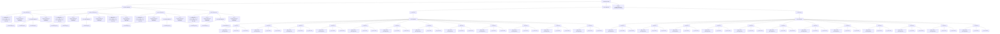

# BaselineHeteroGNN モデル構造

自動生成: 2026-09-17 00:17:43（train.py 実行時に上書きされる）

- 総パラメータ数: 216,734
- 学習対象パラメータ数: 216,734

```mermaid
graph TD
    n0["BaselineHeteroGNN"]
    n1["encoders: ModuleDict"]
    n0 --> n1
    n2["stock: NodeEncoder"]
    n1 --> n2
    n3["cont_norm: LayerNorm((11,), eps=1e-05, elementwise_affine=True, bias=True)"]
    n2 --> n3
    n4["cont_lin: Linear(in_features=11, out_features=64, bias=True)"]
    n2 --> n4
    n5["cat_embeds: ModuleList"]
    n2 --> n5
    n6["0: Embedding(35, 8)"]
    n5 --> n6
    n7["1: Embedding(19, 8)"]
    n5 --> n7
    n8["2: Embedding(9, 8)"]
    n5 --> n8
    n9["3: Embedding(12, 8)"]
    n5 --> n9
    n10["4: Embedding(4, 8)"]
    n5 --> n10
    n11["cat_lin: Linear(in_features=40, out_features=64, bias=True)"]
    n2 --> n11
    n12["statement: NodeEncoder"]
    n1 --> n12
    n13["cont_norm: LayerNorm((55,), eps=1e-05, elementwise_affine=True, bias=True)"]
    n12 --> n13
    n14["cont_lin: Linear(in_features=55, out_features=64, bias=True)"]
    n12 --> n14
    n15["cat_embeds: ModuleList"]
    n12 --> n15
    n16["0: Embedding(5, 8)"]
    n15 --> n16
    n17["cat_lin: Linear(in_features=8, out_features=64, bias=True)"]
    n12 --> n17
    n18["date_norm: LayerNorm((1,), eps=1e-05, elementwise_affine=True, bias=True)"]
    n12 --> n18
    n19["date_lin: Linear(in_features=1, out_features=64, bias=True)"]
    n12 --> n19
    n20["option: NodeEncoder"]
    n1 --> n20
    n21["cont_norm: LayerNorm((13,), eps=1e-05, elementwise_affine=True, bias=True)"]
    n20 --> n21
    n22["cont_lin: Linear(in_features=13, out_features=64, bias=True)"]
    n20 --> n22
    n23["cat_embeds: ModuleList"]
    n20 --> n23
    n24["0: Embedding(5, 8)"]
    n23 --> n24
    n25["1: Embedding(242, 8)"]
    n23 --> n25
    n26["2: Embedding(220, 8)"]
    n23 --> n26
    n27["cat_lin: Linear(in_features=24, out_features=64, bias=True)"]
    n20 --> n27
    n28["future: NodeEncoder"]
    n1 --> n28
    n29["cont_norm: LayerNorm((10,), eps=1e-05, elementwise_affine=True, bias=True)"]
    n28 --> n29
    n30["cont_lin: Linear(in_features=10, out_features=64, bias=True)"]
    n28 --> n30
    n31["cat_embeds: ModuleList"]
    n28 --> n31
    n32["0: Embedding(14, 8)"]
    n31 --> n32
    n33["1: Embedding(224, 8)"]
    n31 --> n33
    n34["cat_lin: Linear(in_features=16, out_features=64, bias=True)"]
    n28 --> n34
    n35["convs: ModuleList"]
    n0 --> n35
    n36["0: HeteroConv"]
    n35 --> n36
    n37["convs: ModuleDict"]
    n36 --> n37
    n38["<future___corr___future>: GraphConv"]
    n37 --> n38
    n39["aggr_module: MeanAggregation"]
    n38 --> n39
    n40["lin_rel: Linear"]
    n38 --> n40
    n41["lin_root: Linear"]
    n38 --> n41
    n42["<future___prev___future>: GraphConv"]
    n37 --> n42
    n43["aggr_module: MeanAggregation"]
    n42 --> n43
    n44["lin_rel: Linear"]
    n42 --> n44
    n45["lin_root: Linear"]
    n42 --> n45
    n46["<option___corr___option>: GraphConv"]
    n37 --> n46
    n47["aggr_module: MeanAggregation"]
    n46 --> n47
    n48["lin_rel: Linear"]
    n46 --> n48
    n49["lin_root: Linear"]
    n46 --> n49
    n50["<option___prev___option>: GraphConv"]
    n37 --> n50
    n51["aggr_module: MeanAggregation"]
    n50 --> n51
    n52["lin_rel: Linear"]
    n50 --> n52
    n53["lin_root: Linear"]
    n50 --> n53
    n54["<statement___prev___statement>: GraphConv"]
    n37 --> n54
    n55["aggr_module: MeanAggregation"]
    n54 --> n55
    n56["lin_rel: Linear"]
    n54 --> n56
    n57["lin_root: Linear"]
    n54 --> n57
    n58["<statement___report___stock>: GraphConv"]
    n37 --> n58
    n59["aggr_module: MeanAggregation"]
    n58 --> n59
    n60["lin_rel: Linear"]
    n58 --> n60
    n61["lin_root: Linear"]
    n58 --> n61
    n62["<stock___rev_report___statement>: GraphConv"]
    n37 --> n62
    n63["aggr_module: MeanAggregation"]
    n62 --> n63
    n64["lin_rel: Linear"]
    n62 --> n64
    n65["lin_root: Linear"]
    n62 --> n65
    n66["<stock___corr___stock>: GraphConv"]
    n37 --> n66
    n67["aggr_module: MeanAggregation"]
    n66 --> n67
    n68["lin_rel: Linear"]
    n66 --> n68
    n69["lin_root: Linear"]
    n66 --> n69
    n70["<stock___derivative___future>: GraphConv"]
    n37 --> n70
    n71["aggr_module: MeanAggregation"]
    n70 --> n71
    n72["lin_rel: Linear"]
    n70 --> n72
    n73["lin_root: Linear"]
    n70 --> n73
    n74["<future___rev_derivative___stock>: GraphConv"]
    n37 --> n74
    n75["aggr_module: MeanAggregation"]
    n74 --> n75
    n76["lin_rel: Linear"]
    n74 --> n76
    n77["lin_root: Linear"]
    n74 --> n77
    n78["<stock___derivative___option>: GraphConv"]
    n37 --> n78
    n79["aggr_module: MeanAggregation"]
    n78 --> n79
    n80["lin_rel: Linear"]
    n78 --> n80
    n81["lin_root: Linear"]
    n78 --> n81
    n82["<option___rev_derivative___stock>: GraphConv"]
    n37 --> n82
    n83["aggr_module: MeanAggregation"]
    n82 --> n83
    n84["lin_rel: Linear"]
    n82 --> n84
    n85["lin_root: Linear"]
    n82 --> n85
    n86["1: HeteroConv"]
    n35 --> n86
    n87["convs: ModuleDict"]
    n86 --> n87
    n88["<future___corr___future>: GraphConv"]
    n87 --> n88
    n89["aggr_module: MeanAggregation"]
    n88 --> n89
    n90["lin_rel: Linear"]
    n88 --> n90
    n91["lin_root: Linear"]
    n88 --> n91
    n92["<future___prev___future>: GraphConv"]
    n87 --> n92
    n93["aggr_module: MeanAggregation"]
    n92 --> n93
    n94["lin_rel: Linear"]
    n92 --> n94
    n95["lin_root: Linear"]
    n92 --> n95
    n96["<option___corr___option>: GraphConv"]
    n87 --> n96
    n97["aggr_module: MeanAggregation"]
    n96 --> n97
    n98["lin_rel: Linear"]
    n96 --> n98
    n99["lin_root: Linear"]
    n96 --> n99
    n100["<option___prev___option>: GraphConv"]
    n87 --> n100
    n101["aggr_module: MeanAggregation"]
    n100 --> n101
    n102["lin_rel: Linear"]
    n100 --> n102
    n103["lin_root: Linear"]
    n100 --> n103
    n104["<statement___prev___statement>: GraphConv"]
    n87 --> n104
    n105["aggr_module: MeanAggregation"]
    n104 --> n105
    n106["lin_rel: Linear"]
    n104 --> n106
    n107["lin_root: Linear"]
    n104 --> n107
    n108["<statement___report___stock>: GraphConv"]
    n87 --> n108
    n109["aggr_module: MeanAggregation"]
    n108 --> n109
    n110["lin_rel: Linear"]
    n108 --> n110
    n111["lin_root: Linear"]
    n108 --> n111
    n112["<stock___rev_report___statement>: GraphConv"]
    n87 --> n112
    n113["aggr_module: MeanAggregation"]
    n112 --> n113
    n114["lin_rel: Linear"]
    n112 --> n114
    n115["lin_root: Linear"]
    n112 --> n115
    n116["<stock___corr___stock>: GraphConv"]
    n87 --> n116
    n117["aggr_module: MeanAggregation"]
    n116 --> n117
    n118["lin_rel: Linear"]
    n116 --> n118
    n119["lin_root: Linear"]
    n116 --> n119
    n120["<stock___derivative___future>: GraphConv"]
    n87 --> n120
    n121["aggr_module: MeanAggregation"]
    n120 --> n121
    n122["lin_rel: Linear"]
    n120 --> n122
    n123["lin_root: Linear"]
    n120 --> n123
    n124["<future___rev_derivative___stock>: GraphConv"]
    n87 --> n124
    n125["aggr_module: MeanAggregation"]
    n124 --> n125
    n126["lin_rel: Linear"]
    n124 --> n126
    n127["lin_root: Linear"]
    n124 --> n127
    n128["<stock___derivative___option>: GraphConv"]
    n87 --> n128
    n129["aggr_module: MeanAggregation"]
    n128 --> n129
    n130["lin_rel: Linear"]
    n128 --> n130
    n131["lin_root: Linear"]
    n128 --> n131
    n132["<option___rev_derivative___stock>: GraphConv"]
    n87 --> n132
    n133["aggr_module: MeanAggregation"]
    n132 --> n133
    n134["lin_rel: Linear"]
    n132 --> n134
    n135["lin_root: Linear"]
    n132 --> n135
    n136["classifier: Linear(in_features=64, out_features=2, bias=True)"]
    n0 --> n136
```
